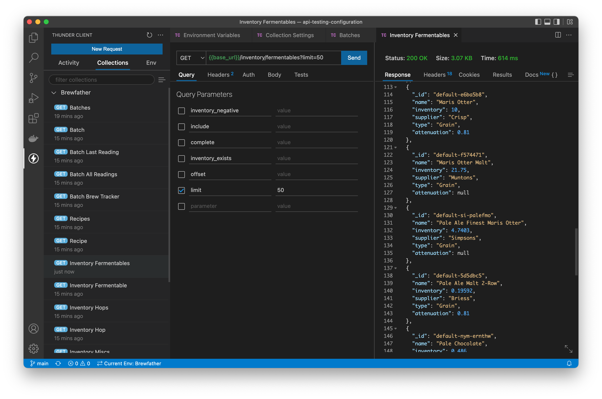

# Thunder Client Configuration for the Brewfather API

- Import both environment and collection files.
- Set basic authentication credentials in "Collection Settings"
- Attach "Brewfather" env to the collection in the "Collection Settings" 